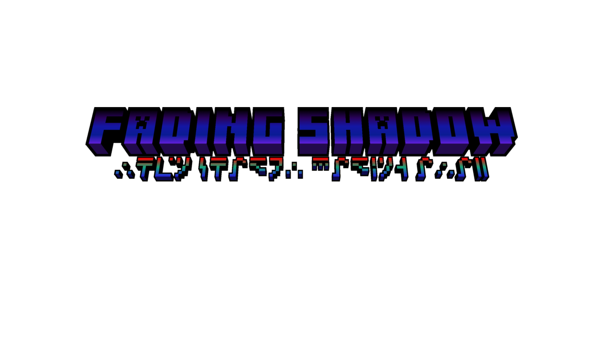

      

# FADING SHADOW

你在追寻何物？  

when the sky is falling.  
when the void crashing.  
when the reality breaks.    
when ... you realize you can did it.  

that time ...  
even the deepest shadow will fading away...  

TO-DO List
=======
| 功能 | 状态 | 说明 |
|------|------|------|
| 战利品表 | ⭕ | 控制方块掉落的物品，实体掉落物和箱子战利品 |
| 物品shader | 🔳 | 实现特殊视觉渲染 |
| geo方块动画 | ✅ | 方块动画 |
| 数据生成 | 🔳 | - |
| 新生物 | 🔳 | - |
| 新群系 | 🔳 | - |
| 新生物 | 🔳 | - |
| 多方块结构 | 🔳 | - |
| GUI方块交互 | 🔳 | - |
| 这是一个示例 | ✅ | 已完成 |
| 这是两个示例 | ⭕ | 正在实现 |
| 这是三个示例 | 🔳 | 未完成 |

License
=======
- code: https://opensource.org/licenses/Apache-2.0
- assets: https://creativecommons.org/licenses/by-nc-sa/4.0/

Installation information
=======

This template repository can be directly cloned to get you started with a new
mod. Simply create a new repository cloned from this one, by following the
instructions provided by [GitHub](https://docs.github.com/en/repositories/creating-and-managing-repositories/creating-a-repository-from-a-template).

Once you have your clone, simply open the repository in the IDE of your choice. The usual recommendation for an IDE is either IntelliJ IDEA or Eclipse.

If at any point you are missing libraries in your IDE, or you've run into problems you can
run `gradlew --refresh-dependencies` to refresh the local cache. `gradlew clean` to reset everything 
{this does not affect your code} and then start the process again.

Mapping Names:
============
By default, the MDK is configured to use the official mapping names from Mojang for methods and fields 
in the Minecraft codebase. These names are covered by a specific license. All modders should be aware of this
license. For the latest license text, refer to the mapping file itself, or the reference copy here:
https://github.com/NeoForged/NeoForm/blob/main/Mojang.md

Additional Resources: 
==========
Community Documentation: https://docs.neoforged.net/  
NeoForged Discord: https://discord.neoforged.net/
